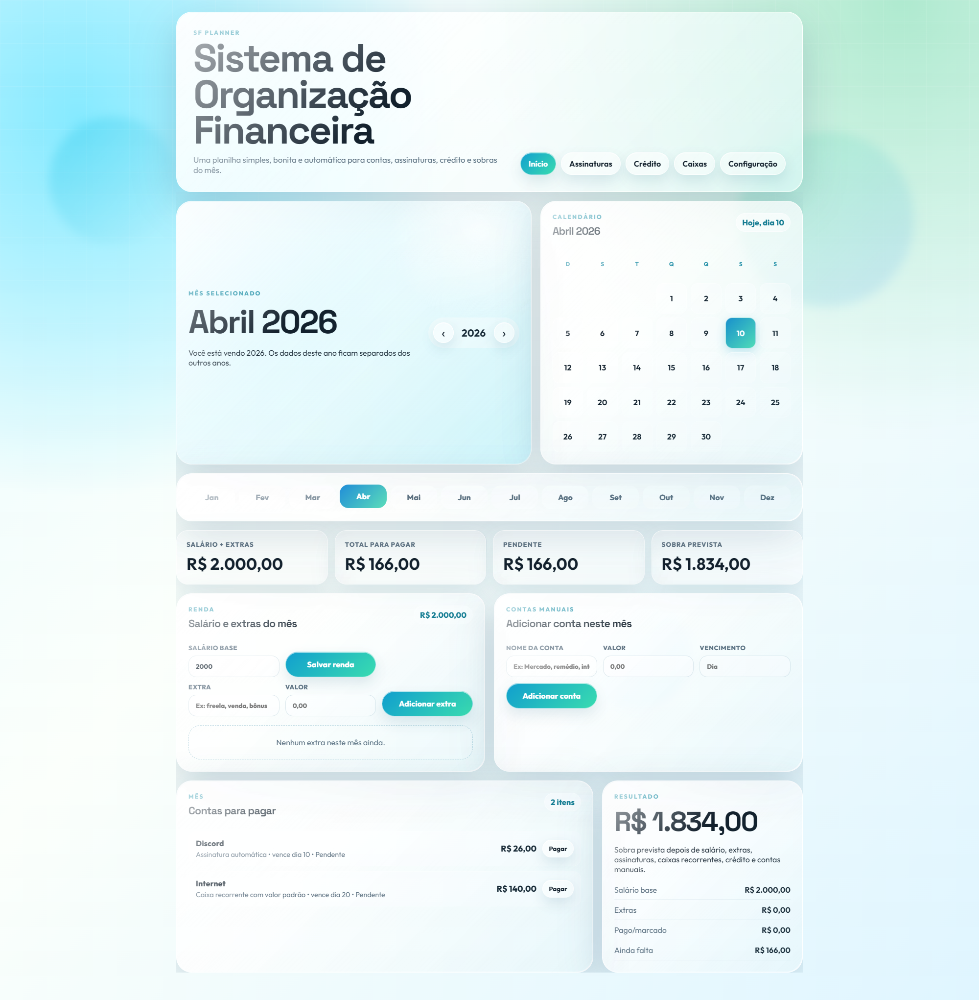

# SF Sistema de Organização Financeira

Site local para organizar contas do mês, salário, extras, assinaturas, crédito parcelado e contas recorrentes variáveis.

## Preview



## Como abrir

Instale as dependências uma vez:

```powershell
npm install
```

Inicie em modo desenvolvimento:

```powershell
npm run dev
```

Depois abra `http://127.0.0.1:5173`.

Para gerar a versão otimizada de produção:

```powershell
npm run build
```

## Como os dados são salvos

Os dados ficam no `localStorage` do navegador. Isso significa que:

- cada navegador tem seus próprios dados;
- os dados continuam salvos ao fechar e abrir o site;
- limpar os dados do navegador pode apagar as informações;
- os anos ficam separados, então mudar de ano não apaga o ano anterior.
- Adicionei um opção de backup nas configurações, você pode exportar e importar.

## Arquivos

- `index.html`: estrutura da página.
- `styles.css`: visual liquid glass / Frutiger Aero moderno.
- `app.js`: cálculos, meses, anos, contas, assinaturas, créditos e salvamento local.
